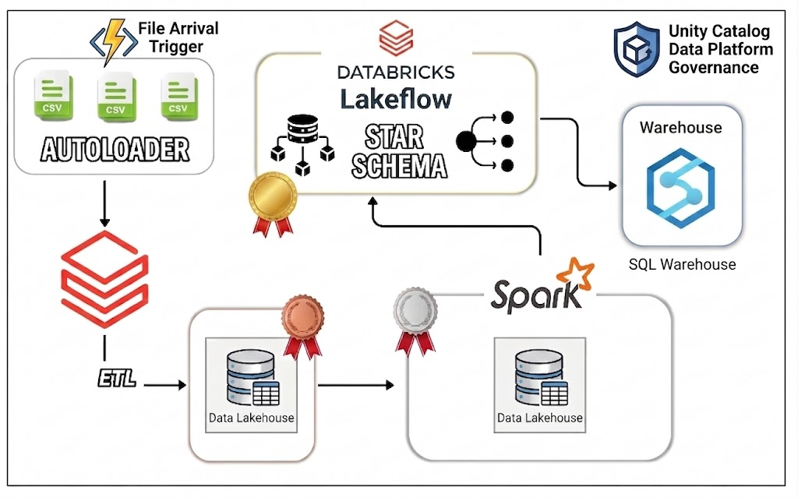

# Enterprise Aviation Data Lakehouse ✈️


An end-to-end, event-driven Medallion Data Architecture built on Databricks. This project ingests raw aviation data (flights, bookings, passengers, airports), processes it through a strict data quality pipeline using Databricks Lakeflow(Delta Live Tables), and serves it to BI analysts via a perfectly modeled Gold Star Schema.

---

## 🏗️ Architecture Pipeline



---

## 📖 Project Overview

Modern airlines generate massive volumes of highly dynamic data. Flight schedules change, passenger profiles update, and booking prices fluctuate constantly. The goal of this project is to build an enterprise-grade, event-driven data platform capable of ingesting this chaotic raw data and transforming it into a pristine, mathematically accurate foundation for Business Intelligence (BI) and analytics. 

Instead of relying on rigid, scheduled batch jobs, this architecture utilizes **Databricks Workflows** and **File Arrival Triggers** to process new data the moment it lands in Cloud Storage. By implementing a strict **Medallion Data Lakehouse Architecture** (Bronze, Silver, Gold), the pipeline guarantees data quality, tracks historical changes, and ultimately serves a highly optimized Star Schema to end-users while strictly enforcing Unity Catalog security policies.

### 🧠 Architectural Highlights & Problem Solving

* **Taming Streaming Updates with CDC:** Standard streaming pipelines struggle with data updates (like a passenger changing their name or a booking price changing). This project solves that by leveraging Databricks Delta Live Tables (DLT) and the `create_auto_cdc_flow` API. It automatically applies Slowly Changing Dimension (SCD) Type 1 logic for dimensions and SCD Type 2 logic for bookings, ensuring a perfect historical audit trail without writing complex SQL `MERGE` statements.
* **Resilient Ingestion:** The Bronze layer uses **Databricks Auto Loader** (`cloudFiles`). This ensures the system can handle schema drift, safely rescue corrupted rows, and keep track of exactly which files have been processed using incremental state management.
* **Decoupled Orchestration:** The pipeline is broken into modular components. A master orchestrator maps the storage volumes and dynamically triggers parallel worker notebooks for ingestion, ensuring maximum cluster utilization before passing the baton to the DLT pipeline.
* **The "Smart" Batch Gold Layer:** While Bronze and Silver are incremental, the Gold layer is constructed using **Materialized Views**. This architectural choice ensures that complex table joins and aggregations are perfectly accurate and never suffer from the "double-counting" risks associated with streaming aggregations on SCD2 tables. 

### 🎯 Business Value Delivered

* **Near Real-Time Analytics:** Dashboards update automatically within minutes of new CSVs arriving from operational source systems.
* **Data Trust:** Built-in DLT Data Quality Expectations (`@dlt.expect_or_drop`) quarantine bad records before they ever reach the analytical tables.
* **Optimized BI Performance:** The final Gold layer is modeled as a traditional Star Schema, allowing tools like Power BI or Tableau to query the data instantly without performing expensive joins in the BI engine.
* **Zero-Trust Security:** Analysts are granted read-only access exclusively to the pre-calculated Gold schema via Unity Catalog Role-Based Access Control (RBAC), completely shielding the raw data and intermediate CDC tables from unauthorized access.

---

## 🚀 Key Features

* **Event-Driven Ingestion:** Utilizes Databricks Workflows with File Arrival Triggers to instantly ingest raw S3/Volume files the moment they land, dropping the need for costly scheduled batch clusters.
* **Databricks Auto Loader:** Parallelized streaming ingestion using `cloudFiles` to handle schema evolution and efficient state tracking.
* **Automated Change Data Capture (CDC):** Uses DLT's `apply_changes` and `create_auto_cdc_flow` to automatically handle SCD Type 1 (Dimensions) and SCD Type 2 (Historical Bookings) tracking.
* **Self-Maintaining Tables:** Implements `delta.autoOptimize.optimizeWrite` and `autoCompact` to continuously clean and optimize Parquet file sizes under the hood.
* **Data Quality Constraints:** Built-in `@dlt.expect_or_drop` rules ensure only valid records make it into the Silver layer.
* **Strict Unity Catalog Governance:** Employs Role-Based Access Control (RBAC) via SQL to enforce the Principle of Least Privilege.

---

## 📊 The Medallion Data Layers

### 🥉 Bronze (Raw)
* **Technology:** PySpark Structured Streaming & Auto Loader.
* **Purpose:** Raw, unprocessed append-only landing zone. Captures files exactly as they arrive from source systems.

### 🥈 Silver (Cleansed & Conformed)
* **Technology:** Delta Live Tables (Streaming Tables).
* **Purpose:** Filtered, deduplicated, and validated data.
    * `silver_flights`, `silver_airports`, `silver_passengers`: **SCD Type 1** (Latest state only).
    * `silver_bookings`: **SCD Type 2** (Full historical tracking of price/status changes).

### 🥇 Gold (Business-Level Star Schema)
* **Technology:** Delta Live Tables (Materialized Views).
* **Purpose:** Pre-aggregated, mathematically accurate analytics layer ready for Power BI/Tableau.
    * **Dimensions:** `dim_passengers`, `dim_airports`, `dim_flights`
    * **Fact:** `fact_bookings` (Filters for `__END_AT IS NULL` to prevent double-counting revenue from SCD2 history).
    
---

## 🛠️ Tech Stack

| Layer | Technology |
|---|---|
| Ingestion | Databricks Auto Loader (`cloudFiles`) |
| Orchestration | Databricks Workflows + File Arrival Triggers |
| Transformation | Lakeflow Spark Declarative Pipelines (DLT) |
| CDC | `create_auto_cdc_flow` (SCD1 + SCD2) |
| Storage | Delta Lake on cloud object storage |
| Governance | Unity Catalog RBAC |
| BI | Databricks SQL Dashboards |
| Language | Python (PySpark), SQL |

---

## 📂 Repository Structure

```text
├── pipeline_code/
│   ├── Lakeflow-Gold-Layer/                # Lakeflow pipeline code for the Gold Star Schema
│   │   └── my_transformation.py
│   ├── Lakeflow-Silver-Layer/              # Lakeflow pipeline code for Silver CDC transformations
│   │   └── my_transformation.py
│   ├── Bronze-Autoloader.py                # Worker notebook for Auto Loader ingestion
│   ├── Bronze-Orchestrator.py              # Orchestrates the parallel ingestion
│   ├── Setup.py                            # Environment and configuration setup script
│   └── Unity-Catalog-Data-Governance.py    # RBAC and security lock-down scripts
├── docs/
│   └── pipeline_architecture.jpg           # Visual DAG of the Databricks Workflow
└── README.md                               # Project documentation
